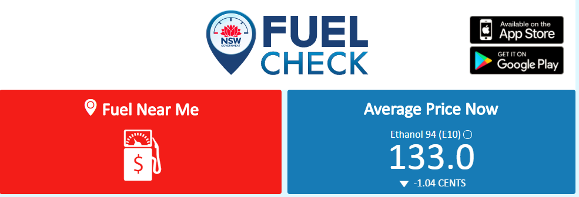

```{r setup, include=FALSE, cache=FALSE}
library(knitr)
opts_chunk$set(echo = TRUE, eval=FALSE, dpi=300)
read_chunk('read_andgeo_fuelprices.R')
```

```{r getdata_prep, include=FALSE, eval=FALSE}
# Do this once or when needed (one minute)
source("read_andgeo_fuelprices.R")
save.image("cache/fuel_objects.RData")
```

```{r loaddata, include=FALSE, eval=TRUE}
load("cache/fuel_objects.RData")
```

```{r loadpackages, eval=TRUE, include=FALSE}
pacman::p_load(dplyr, oz, magicaxis, deldir, rgeos, ggplot2, gridExtra)
```

### *How do petrol prices vary across the state?*

The price of fuel at service stations varies tremendously, both in space - across the large Australian state of New South Wales, and time - with surprising patterns. In this post I begin my quest to understand how fuel price varies, what factors explain its fluctuation over time and spatial variation. Obviously it would be nice to be able to know where to drive for cheaper fuel (what kind of areas are cheaper?), and when to fill up (should I wait until Thursday?).

Since August 2016, the NSW government runs the [FuelCheck service](https://www.fuelcheck.nsw.gov.au/app), which allows monitoring of fuel prices *in real time*. Several apps tap into this publicly available API, allowing users to find the cheapest fuel in the neighborhood, or inspect some simple graphs of fuel price over time.

As an additional service, (nearly) daily prices of all types of fuel, all brands of service stations, and **all locations** across the state can be downloaded from the [NSW Data portal](https://data.nsw.gov.au/), currently from August 2016 to October 2017. The dataset contains over one million records, for over 2000 service stations, and 11 fuel types. 




### Approach

This is the first in a series of posts on this hobby project to find out if we can *predict fuel prices in space and time*. What I want to know is:

- Is fuel cheaper on a particular day of the week? It is a widely-held belief that fuel prices are more expensive on the day that everyone receives their weekly paycheck (Thursday), but do the data support this? 

- Across the state, how does fuel price vary and why? Quick inspection of the data shows that remote areas are more expensive; how do we summarize that, and what else matters? As roughly 5 out of 7.5 million people in NSW live in the Sydney metropolitan area - that is two thirds of the population on 1.5% of the land area - I will look at Sydney and non-Sydney data separately for much of this analysis.

Instead of just showing results, these posts are very much about getting into the details of the R code to generate them. 

But before we get started, here is a taste of what's to come:


```{r figure1, echo=FALSE, fig.width=9, fig.height=5}

library(dplyr)
metro <- filter(fuel, Address %in% c("741 George St, Windsor South NSW 2756",
                                  "552 Pennant Hills Road, West Pennant Hills NSW 2125"))

remot <- filter(fuel, Address %in% c("1 Blende St, Broken Hill NSW 2880",
                                     "119 Bourke St Cnr Erskine St, Dubbo NSW 2830"))


library(ggplot2)


g1 <- filter(metro, FuelCode == "U91") %>%
  ggplot(aes(x=Date, y=Price, col=Address)) +
  geom_line() +
  geom_point(size=1) +
  theme_bw() +
  theme(legend.position="none")
                                  
g2 <- filter(remot, FuelCode == "U91") %>%
  ggplot(aes(x=Date, y=Price, col=Address)) +
  geom_line() +
  geom_point(size=1) +
  theme_bw() +
  theme(legend.position="none")

library(gridExtra)
grid.arrange(g1, g2, ncol=2)

```


The data show a fluctuation in fuel prices [that is known](https://www.accc.gov.au/consumers/petrol-diesel-lpg/petrol-price-cycles#petrol-prices-in-sydney), but are not at all weekly. 


# Getting the Data

The FuelCheck service in New South Wales, Australia, provides real-time data on fuel prices at service stations across the state. [This page](https://data.nsw.gov.au/data/dataset/fuel-check) contains information, as well as monthly files containing fuel prices for all service stations, for all fuel types. The first step is to download all `xlsx` files, and save them locally. We then use `readxl` to read them all, and `dplyr` to tidy things up.

```{r load_packages}

```

And then

```{r read_fuel_raw}

```

You can skip this step as I have bundled the clean dataset in the R package `fuelpricensw`, which is available on [this Github repos](https://github.com/RemkoDuursma/fuelpricensw). 

```{r}
devtools::install_github("remkoduursma/fuelpricensw")
library(fuelpricensw)
data(fuel)
```


## Geocoding

The fuel price dataset contains street addresses of all service stations, but we would like to include latitude and longitude, so that other spatial attributes can easily be looked up. Here I used Google's geocode service, as made easily available in the `ggmap` package.

```{r get_lat_long}

```

Get rid of USA addresses. When geocode does not find a good match, Google returns some random address in the USA. Better approaches exist here, like the geonames service to find the country code.

```{r filter_locs}
 
```


## Distance to nearest competitor

```{r, nearest_neighbours}

```


The distance to the nearest next service station peaks at 1km (1000m). The most remote service station appears to be `r locs[which.max(locs$dist_1),"Address"]`, though recall geocoding failed for some stations, so we don't have distance to all stations.

```{r hist_dist_1, eval=TRUE}
hist(log10(locs$dist_1), breaks=100, axes=FALSE,
     main="", col="cornflowerblue",
     xlab="Distance to nearest service station (m)")
magicaxis::magaxis(side=1, unlog=1)
axis(2)
```

## Area served : Voronoi polygons


```{r plain_voronoi}
```

```{r voro_plain_fig, fig.width=10, fig.height=8, eval=TRUE}
par(mar=c(3,3,1,1))
plot(voro_plain, wlines="tess", wpoints="real", 
     lty=1, col=c("black","grey","red","black","black"),
     cex=0.6, xlab="", ylab="")
box()

```


```{r buffer_voronoi}
```


```{r buffer_voronoi_fig, eval=TRUE}
par(mar=c(0,0,0,0))
plot(voro_buffer)
with(locs, points(lon, lat, pch=19, cex=0.5,
                  col=rev(heat.colors(10))[cut(log(area_voronoi),10)]))

```


## Remoteness, distance to coast

Eventually I want to build a model that predicts fuel price based on location, and time of year. To do so, we have to start adding some features of interest. The Atlas of Living Australia provides a 'remoteness index', which seems interesting since at first sight fuel prices are much higher for more remote locations. Though the ALA provides API services, I did this the quick way by visiting [this page](http://spatial.ala.org.au/webportal/), uploading a CSV with lat and long, and downloading a CSV file with a remoteness index, and the distance to coast. You can read more about how the (unitless) remoteness index is [calculated here](http://spatial.ala.org.au/layers/more/aria).

```{r remoteness}
```


```{r remote_plot, eval=TRUE}
locs2 <- dplyr::select(fuel, Address, Brand) %>% 
  distinct %>% left_join(locs, by="Address")

with(locs2, plot(dist_to_coast, remoteness, pch=19,
                col=as.factor(Brand)))
```


```{r remote_fig, eval=FALSE}
# Figure
library(oz)
oz(sections=c(4, 13:15))
cols <- colorRampPalette(c("yellow","darkorange","red"))(10)
with(locs, points(lon,lat, pch=19, col=cols[cut(log(remoteness+1), 10)]))

```


## Combined dataset

```{r final_merge}

```


